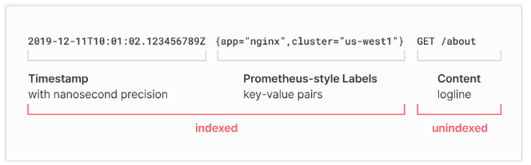

# prometheus-export
<i>python-prometheus-export

Prometheus provides client libraries based on Python, Go, Ruby and others that we can use to generate metrics with the necessary labels. 
- Such an exporter can be included directly in the code of your application
- it can be run as a separate service that will poll one of your services and receive data from it, which will then be converted into the Prometheus format and sent to the Prometheus server. 

When Prometheus scrapes your instance's HTTP endpoint, the client library sends the current state of all tracked metrics to the server.

The prometheus_client package supports exposing metrics from software written in Python, so that they can be scraped by a Prometheus service.
Metrics can be exposed through a standalone web server, or through Twisted, WSGI and the node exporter textfile collector.

- API Interface : DB Interface API to get the recors from the DB(https://github.com/euiyounghwang/DB-Interface-Export), ES Configuration API to get the configuration for all env's(https://github.com/euiyounghwang/es-config-interface), Kafka Interface API to get Offsets/ISR information(https://github.com/euiyounghwang/kafka_job_interface_service)


#### Python V3.9 Install
```bash
sudo yum install gcc openssl-devel bzip2-devel libffi-devel zlib-devel git 
wget https://www.python.org/ftp/python/3.9.0/Python-3.9.0.tgz 
tar –zxvf Python-3.9.0.tgz or tar -xvf Python-3.9.0.tgz 
cd Python-3.9.0 
./configure --libdir=/usr/lib64 
sudo make 
sudo make altinstall 

# python3 -m venv .venv --without-pip
sudo yum install python3-pip

sudo ln -s /usr/lib64/python3.9/lib-dynload/ /usr/local/lib/python3.9/lib-dynload

python3 -m venv .venv
source .venv/bin/activate

# pip install -r ./dev-requirement.txt
pip install prometheus-client
pip install requests
pip install JPype1
pip install psycopg2-binary
pip install jaydebeapi
pip install pytz
pip install httpx

# when error occur like this
# ImportError: urllib3 v2 only supports OpenSSL 1.1.1+, currently the 'ssl' module is compiled with 'OpenSSL 1.0.2k-fips  26 Jan 2017'. See: https://github.com/urllib3/urllib3/issues/2168
pip install urllib3==1.26.18
pip install pytz
```


### Using Poetry: Create the virtual environment in the same directory as the project and install the dependencies:
```bash
python -m venv .venv
source .venv/bin/activate
pip install poetry

# --
poetry config virtualenvs.in-project true
poetry init
poetry add prometheus-client
poetry add psutil
poetry add pytz
poetry add JPype1
poetry add psycopg2-binary
poetry add jaydebeapi

...

# start with gunicorn config
gunicorn.config.py

import multiprocessing
 
workers = multiprocessing.cpu_count() * 2 + 1
worker_class = "uvicorn.workers.UvicornWorker"
wsgi_app = "app.main:app"
timeout = 60
loglevel = "info"
bind = "0.0.0.0:8000"
max_requests = 1000
max_requests_jitter = 100

...
gunicorn -c app/gunicorn.config.py

gunicorn -k uvicorn.workers.UvicornWorker main:app --bind 0.0.0.0:8004 --workers 4

..
uvicorn app.main:app --reload for dev
```
or you can run this shell script `./create_virtual_env.sh` to make an environment. then go to virtual enviroment using `source .venv/bin/activate`


### Architecture
- Prometheus, Loki, Promtail, Grafana, Collector as export app (Exports data in the Prometheus format, which allows it to be scraped by a Prometheus server.)
- Promtail(https://github.com/grafana/loki/releases/) is an agent which ships the contents of local logs to a private Grafana Loki. Loki is a horizontally scalable, highly available, multi-tenant log aggregation system inspired by Prometheus and developed by Grafana Labs. Loki(https://github.com/grafana/loki/releases/) aims to simplify effective and user-friendly collection and storage of logs.
- Flow (./architecure/Data_Flow.PNG)
- https://rulyox.blog/2021-10-24-Prometheus-Loki-Grafana%EB%A5%BC-%EC%9D%B4%EC%9A%A9%ED%95%9C-%EB%AA%A8%EB%8B%88%ED%84%B0%EB%A7%81-%EC%8B%9C%EC%8A%A4%ED%85%9C-%EA%B5%AC%EC%B6%95/
- Installation : https://m.blog.naver.com/setopia1112/223123551825
- Grafana Loki Setup
```bash
wget https://github.com/grafana/loki/releases/download/v2.9.1/loki-linux-amd64.zip
unzip loki-linux-amd64.zip
./loki-linux-amd64 --config.file=./loki-config.yml
nohup ./loki-linux-amd64 -config.file=./loki-config.yaml 2>&1 &

# --
auth_enabled: false

server:
  http_listen_port: 3100
  grpc_listen_port: 9096

common:
  instance_addr: 0.0.0.0
  path_prefix: ./tmp/loki
  storage:
    filesystem:
      chunks_directory: ./tmp/loki/chunks
      rules_directory: ./tmp/loki/rules
  replication_factor: 1
  ring:
    kvstore:
      store: inmemory

query_range:
  results_cache:
    cache:
      embedded_cache:
        enabled: true
        max_size_mb: 100

schema_config:
  configs:
    - from: 2020-10-24
      store: boltdb-shipper
      object_store: filesystem
      schema: v11
      index:
        prefix: index_
        period: 24h

ruler:
  alertmanager_url: http://localhost:9093

limits_config:
    enforce_metric_name: false
    ingestion_burst_size_mb: 20
    ingestion_rate_mb: 200
    ingestion_rate_strategy: global
    max_cache_freshness_per_query: 10m
    max_global_streams_per_user: 10000
    max_query_length: 12000h
    max_query_parallelism: 16
    max_streams_per_user: 0
    max_entries_limit_per_query: 1000000
    reject_old_samples: true
    reject_old_samples_max_age: 168h
# --
```
- Pushing Logs to Loki Without Using Promtail (https://medium.com/geekculture/pushing-logs-to-loki-without-using-promtail-fc31dfdde3c6, https://github.com/sleleko/devops-kb/blob/master/python/push-to-loki.py)
- Pushing Logs to Loki with "python-logging-loki"
- Grafana Dashboard : {service=~"prometheus-monitoring-service|prometheus-monitoring-service1"}
```bash
pip install python-logging-loki

import logging
import logging_loki
logging_loki.emitter.LokiEmitter.level_tag = "level"
# assign to a variable named handler 
handler = logging_loki.LokiHandler(
   url="http://loki:3100/loki/api/v1/push",
   version="1",
)
# create a new logger instance, name it whatever you want
logger = logging.getLogger("my-logger")
logger.addHandler(handler)

# now use the logging object's functions as you normally would
logger.error(
   "Something bad happened",
  
   extra={"tags": {"service": "my-service"}},
)
logger.warning(
   "Something bad happened but we can keep going",
   extra={"tags": {"service": "my-service"}},
)
# extra={"tags": {"service": "my-service", "one": "more thing"}}
```

- Grafana Promtail Setup
```bash
wget https://github.com/grafana/loki/releases/download/v2.8.0/promtail-linux-amd64.zip
unzip promtail-linux-amd64.zip
nohup ./promtail-linux-amd64 -config.file=promtail-config.yaml 2>&1 &

# --
server:
  http_listen_port: 9080
  grpc_listen_port: 0

positions:
  filename: /tmp/positions.yaml

clients:
  - url: http://loki:3100/loki/api/v1/push

scrape_configs:
- job_name: logging
  static_configs:
  - targets:
      - localhost
    labels:
      job: logging
      __path__: /logs/*.log
# --
```
- Promtail Format



### Installation
```bash
pip install prometheus-client
```


### Custom Promethues Exporter
- Expose my metrics for dev kafka cluster to http://localhost:9115
- Expose ES cluster/Kafka/Kibana/Logstash metrics by using this exporter based on ES API/socket library
- EXpose DB records as metrics from `DB-Interface-Export API` with HTTP POST Method
- Interface with `DB Interface Export` (https://github.com/euiyounghwang/DB-Interface-Export) by using FastAPI Framework to get the records as metrics from the specific databse
```bash
# HELP python_gc_objects_collected_total Objects collected during gc
# TYPE python_gc_objects_collected_total counter
python_gc_objects_collected_total{generation="0"} 302.0
python_gc_objects_collected_total{generation="1"} 342.0
python_gc_objects_collected_total{generation="2"} 0.0
...
kafka_health_metric{server_job="localhost"} 3.0
# HELP kafka_connect_nodes_metric Metrics scraped from localhost
# TYPE kafka_connect_nodes_metric gauge
kafka_connect_nodes_metric{server_job="localhost"} 3.0
# HELP kafka_connect_listeners_metric Metrics scraped from localhost
# TYPE kafka_connect_listeners_metric gauge
kafka_connect_listeners_metric{host="localhost",name="test_jdbc",running="RUNNING",server_job="localhost"} 1.0
# HELP zookeeper_health_metric Metrics scraped from localhost
# TYPE zookeeper_health_metric gauge
zookeeper_health_metric{server_job="localhost"} 3.0
# HELP kibana_health_metric Metrics scraped from localhost
# TYPE kibana_health_metric gauge
kibana_health_metric{server_job="localhost"} 1.0
# HELP logstash_health_metric Metrics scraped from localhost
# TYPE logstash_health_metric gauge
logstash_health_metric{server_job="localhost"} 1.0
...
```


### Run Custom Promethues Exporter
- Run this command : $ `python ./standalone-es-service-export.py` or `./standalone-export-run.sh`
```bash

#-- HTTP Server/Client Based
# HTTP Server
$  ./es-service-all-server-export-run.sh status/start/stop or ./server-export-run.sh
Server started.

# Client export
$  ./es-service-all-client-export-run.sh status/start/stop or ./client-export-run.sh

# Client only
./standalone-es-service-export.sh status/start/stop

...
[2024-05-20 20:44:06] [INFO] [prometheus_client_export] [work] http://localhost:9999/health?kafka_url=localhost:9092,localhost:9092,localhost:9092&es_url=localhost:9200,localhost:9200,localhost:9200,localhost:9200&kibana_url=localhost:5601&logstash_url=process
[2024-05-20 20:44:06] [INFO] [prometheus_client_export] [get_metrics_all_envs] 200
[2024-05-20 20:44:06] [INFO] [prometheus_client_export] [get_metrics_all_envs] <Response [200]>
[2024-05-20 20:44:06] [INFO] [prometheus_client_export] [get_metrics_all_envs] {'kafka_url': {'localhost:9092': 'OK', 'GREEN_CNT': 3, 'localhost:9092': 'OK', 'localhost:9092': 'OK'}, 'es_url': {'localhost:9200': 'OK', 'GREEN_CNT': 4, 'localhost:9200': 'OK', 'localhost:9200': 'OK', 'localhost:9200': 'OK'}, 'kibana_url': {'localhost:5601': 'OK', 'GREEN_CNT': 1}, 'logstash_url': 1}
...
```


### Create script with arguments with python
- Run this command : euiyoung.hwang@US-5CD4021CL1-L MINGW64 ~/Git_Workspace/python-prometheus-export/create-script (master) $ `python ./create-script-by-hosts.py`
```bash
euiyoung.hwang@US-5CD4021CL1-L MINGW64 ~/Git_Workspace/python-prometheus-export/create-script (master)
$ python ./create-script-by-hosts.py
2024-05-31 19:58:16,573 : INFO : {
  "dev": {
    "kibana": "kibana:5601",
    "es_url": [
      "es1:9200",
      "es2:9200",
      "es3:9200",
      "es4:9200"
    ],
    "kafka_url": [
      "data1:9092",
      "data2:9092",
      "data3:9092"
    ],
    "kafka_connect_url": [
      "data1:8083",
      "data2:8083",
      "data3:8083"
    ],
    "zookeeper_url": [
      "data1:2181",
      "data2:2181",
      "data3:2181"
    ]
  },
  "localhost": {
    "kafka_url": [
      "data11:9092",
      "data21:9092",
      "data31:9092"
    ],
    "kafka_connect_url": [
      "data11:8083",
      "data21:8083",
      "data31:8083"
    ],
    "zookeeper_url": [
      "data11:2181",
      "data21:2181",
      "data31:2181"
    ],
    "kibana": "kibana1:5601",
    "es_url": [
      "es11:9200",
      "es21:9200",
      "es31:9200",
      "es41:9200",
      "es51:9200"
    ]
  }
}


# dev ENV
python ./standalone-es-service-export.py --interface http --db_http_host localhost:8002 --url jdbc:oracle:thin:bi"$"reporting/None --db_run false --kafka_url data1:9092,data2:9092,data3:9092 --kafka_connect_url data1:8083,data2:8083,data3:8083 --zookeeper_url  data1:2181,data2:2181,data3:2181 --es_url es1:9200,es2:9200,es3:9200,es4:9200 --kibana_url kibana:5601 --interval 30 --sql "SELECT * FROM TEST*"


# localhost ENV
python ./standalone-es-service-export.py --interface http --db_http_host localhost:8002 --url jdbc:oracle:thin:bi"$"reporting/None --db_run false --kafka_url data11:9092,data21:9092,data31:9092 --kafka_connect_url data11:8083,data21:8083,data31:8083 --zookeeper_url  data11:2181,data21:2181,data31:2181 --es_url es11:9200,es21:9200,es31:9200,es41:9200,es51:9200 --kibana_url kibana1:5601 --interval 30 --sql "SELECT * FROM TEST*"
```


### Service Maintance
- Kafka Service
```bash
 /apps/kafka_2.11-0.11.0.0/bin/kafka-topics.sh --describe --zookeeper localhost.am.co.gxo.com:2181,localhost.am.co.gxo.com:2181,localhost.am.co.gxo.com:2181 --topic ELASTIC_PIPELINE_QUEUE
 curl -X POST http://localhost:8083/connectors/epq_wmxd_jdbc/tasks/0/restart
 ```


### Services
- Reference : https://whiteklay.com/kafka/
- What Is Kafka Connect
Kafka Connect is a framework which connects Kafka with external Systems. It helps to move the data in and out of the Kafka. Connect makes it simple to use existing connector.
Kafka Connect helps use to perform Extract (E) and Transform(T) of ETL Process. Connect contains the set of connectors which allows to import and export the data. 

Cconfiguration for common source and sink Connectors. Connectors comes in two flavors:

- Source Connector
Source Connector imports data from other System to Kafka Topic. For eg; Source Connector can ingest entire databases and stream table updates to Kafka topics.

- Sink Connector
Sink Connector exports data from Kafka topic to other Systems. For eg; Sink Connector can deliver data from Kafka topic to an HDFS File.


### H2 Database for log
H2 is an open source Java SQL Database. It can be run in both embedded and server mode. It is widely used as an In-memory database. In-memory database relies on system memory as oppose to disk space for storage of data. Because memory access is faster than disk access.

H2, the Java SQL database. The main features of H2(https://www.h2database.com/html/main.html) are:
- Very fast, open source, JDBC API
- Embedded and server modes; in-memory databases
- Browser based Console application
- Small footprint: around 2.5 MB jar file size
```bash
- H2 Database is running with JDK 11 (http://localhost:8082/)
  - Server Mode
  - Embedded Mode
  - In-Memory Mode

sudo netstat -nlp | grep :8082

# start.sh
--
#!/bin/bash
set -e
SCRIPTDIR="$( cd -- "$(dirname "$0")" >/dev/null 2>&1 ; pwd -P )"

# Web/TCP
nohup $SCRIPTDIR/h2.sh -webAllowOthers -tcp -tcpAllowOthers -tcpPort 9092 &> /dev/null &
#nohup $SCRIPTDIR/h2.sh -webExternalNames localhost,tsgvm00876 -webAllowOthers -tcp -tcpAllowOthers -tcpPort 9092 &> /dev/null &

''' http://localhost:8082/ '''
#- Embedded (Delete all when stopping the service)
jdbc:h2:~/monitoring/h2/data/monitoring
jdbc:h2:tcp://localhost/~/monitoring/h2/data/tcp_monitoring
--

create db file like vi 'test.mv.db'
ALTER USER SA SET PASSWORD 'test'

DROP TABLE MONITORING_LOG;
DROP TABLE ALERT;

# ACTIVE CHAR(1) DEFAULT 'Y' NOT NULL
#CREATE TABLE ALERT(ID INT PRIMARY KEY AUTO_INCREMENT, ENV_NAME VARCHAR(255) NOT NULL, IS_MAILING VARCHAR(255) NULL, IP_ADDRESS VARCHAR(20) NOT NULL, LOG TEXT NULL, CREATE_DATE DATETIME DEFAULT CURRENT_TIMESTAMP NOT NULL);

#CREATE TABLE MONITORING_LOG(ID INT PRIMARY KEY AUTO_INCREMENT, ENV_NAME VARCHAR(255) NOT NULL, HOST_NAME VARCHAR(20) NOT NULL, STATUS VARCHAR(20) NOT NULL, LOG TEXT NULL, CREATE_DATE DATETIME DEFAULT CURRENT_TIMESTAMP NOT NULL);

CREATE TABLE ALERT(ENV_NAME VARCHAR(255) NOT NULL, IS_MAILING VARCHAR(255) NULL, IP_ADDRESS VARCHAR(20) NOT NULL, LOG TEXT NULL, CREATE_DATE DATETIME DEFAULT CURRENT_TIMESTAMP NOT NULL);

CREATE TABLE MONITORING_LOG(ENV_NAME VARCHAR(255) NOT NULL, HOST_NAME VARCHAR(20) NOT NULL, STATUS VARCHAR(100) NOT NULL, IP VARCHAR(20) NOT NULL, LOG TEXT NULL, CREATE_DATE DATETIME DEFAULT CURRENT_TIMESTAMP NOT NULL);

#- INSERT SAMPLE
INSERT INTO ALERT (ENV_NAME, IS_MAILING, IP_ADDRESS, LOG) VALUES('DEV', 'TRUE', '127.0.0.1', 'TEST MESSAGE');
INSERT INTO MONITORING_LOG (ENV_NAME, HOST_NAME, STATUS, IP, LOG) VALUES('DEV', 'localhost', 'ES_RESTARTED', '127.0.0.1', 'TEST MESSAGE');
INSERT INTO MONITORING_LOG (ENV_NAME, HOST_NAME, STATUS, IP, LOG) VALUES('DEV',  'localhost', 'ES_RESET_REPLICA', '127.0.0.1', 'TEST MESSAGE');

#- SELECT
SELECT * FROM ALERT;
SELECT * FROM MONITORING_LOG;

DELETE FROM ALERT WHERE CREATE_DATE < CURRENT_TIMESTAMP() - 7;

SELECT ROWNUM, ENV_NAME,  IS_MAILING, IP_ADDRESS, LOG, CREATE_DATE FROM ALERT 
WHERE CREATE_DATE >= CURRENT_TIMESTAMP- 7
ORDER BY CREATE_DATE DESC;

SELECT ROWNUM, CREATE_DATE, ENV_NAME, HOST_NAME, STATUS, IP, LOG FROM MONITORING_LOG 
WHERE CREATE_DATE >= CURRENT_TIMESTAMP- 7
ORDER BY CREATE_DATE DESC;
```